# NetPractice
*This project has been created as part of the 42 curriculum by abita.*

## Introduction
NetPractice is a systems networking project built around one simple question:

<p align="center">
  <i>how does data actually get from one machine to another?</i>
</p>
                    
This documentation is not a surface level overview. Its a ground up reconstruction of the core concepts needed to reason about networks, starting from how two hosts communicate, all the way up to the abstractions that make the modern internet possible.

The topics covered include the layered structure of TCP/IP and OSI models, IP addressing and subnetting, and the purpose behind constructs like subnet masks, default gateways and broadcast domains. Each concept is explained not just as something to configure, but as something to *understand*, why it exists, what problem it solves, and how it fits into the bigger picture.

By the end, networking stops feeling like a black box and starts feeling like a logical, predictable system, one that can be read, debugged, and reasoned about from the ground up.

## Description
### How does machine A communicate with machine B when connected to a network?
  
First things first, what is a network?

- In essence, a network is made up of computers that are connected to one another in order to share data. Either a cable or a wireless connection can be used to connect these PCs. Switches are the most used method of connecting computers to one another. However, what exactly is a **switch**? In order for two or more computers to link to one another and form a network, it is a central wiring point with several ports.

<p align="center">
  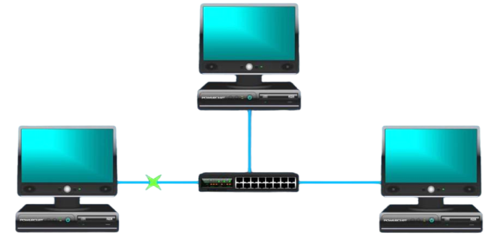
</p>

- This is known as a **LAN**, or local area network, as we have established a network. Additionally, a LAN is a private network. This kind of network is found inside buildings, such homes, businesses, or organizations. Thus, the computers in this network are currently limited to communicating and exchanging data.
  
However, in order for these computers to connect to another network, like the internet, they would have to get in touch with their **Internet Service Provider**, who would then send them a device known as a **gateway**.

<p align="center">
  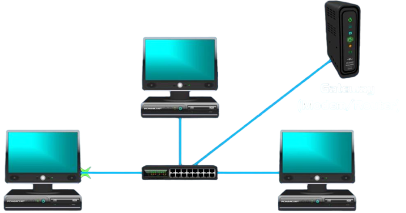
</p>

A gateway is a **modem/router** combo. Then, once the gateway is connected, the computers in this local area network can now access and be a part of a **Wide Area Network or WAN**. A wide area network is a large network of millions of computers that spans over a large geographical area, such as a country, continent or even the entire globe or put in other words the **internet**.


<p align="center">
  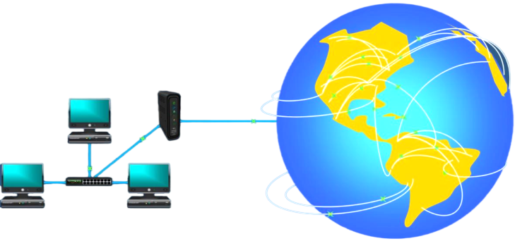
</p>

In our case the internet is an example of the wide area network.

### IP addresses, subnet masks, gateways, switches, routers.

A common occurrence in many firms is the existence of multiple departments.

For example: they may have a *service department* and a *sales department*. And a lot of times that business may want to **separate** **the computer network data** in the different departments from each other so that the sales department doesn't see **any network traffic** from the service department and vice versa. So, what a business will do is that they wil **divide their own LAN** into two **smaller networks**.

<p align="center">
  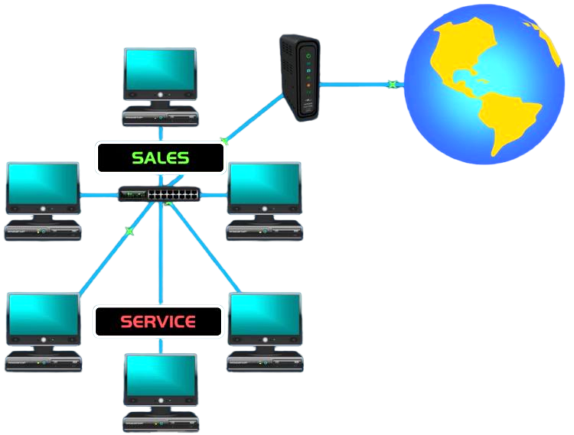
</p>

Refer to these smaller networks as **subnetworks**. Additionally, **subnet** is a shorter term. A subnet is merely a portion of a larger network. This network is still a local area network (LAN), but it has two subnetworks.

A **router** is what separates one network from another. A router serves as a network's entrance or **gateway**. This router is what divides these two subnets.

<p align="center">
  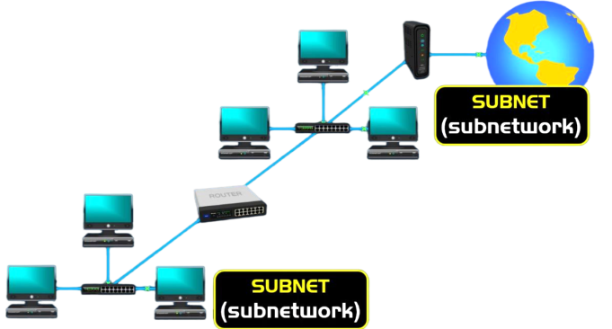
</p>

Additionally, this network is **not** **limited** to **creating** only two **subnets**; the number of subnets it can generate depends on the demands of the business. Therefore, they could further divide this network and create a third subnet by adding another router if this company grew and they wanted to add a new department. The LAN now has three subnets.

<p align="center">
  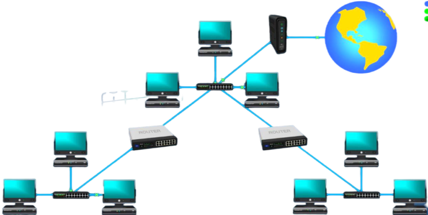
</p>

Moreover, the **reason why** an organization or business would create subnets is to **separate** the **network traffic**. This could be for several different reasons, such as:
- **Manageability**: Because, if any problems happen on a network it would be easier to pinpoint on smaller networks than on large networks.
- **Security**: Subnets can have their own separate security rules to either allow or deny access to certain data.
- **Improve the performance**: This by controlling broadcast traffic. When a computer wants to communicate with other computers on a network it sends out the broadcast to every computer on the network. So, every computer can hear the broadcast traffic from every other computer. But, by braking down a network into smaller subnets, the broadcast are heard by other computers on the same subnet, therefore limiting the amount of broadcast traffic.

An example of a wide area network (WAN) is the internet with all of its computers, servers, and routers. However, there are LANs inside that Wide Area Network. These are private networks found in homes, businesses, and organizations. Additionally, we have subnets divisions of bigger networks within those LANs.

<p align="center">
  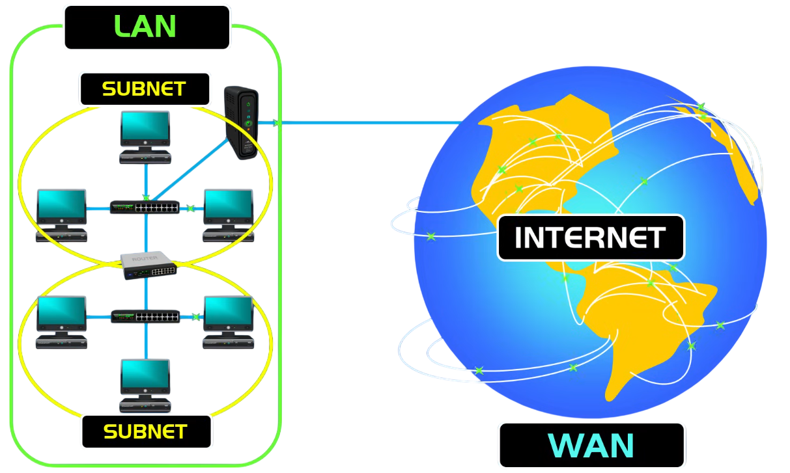
</p>

Even after discussing all of these elements, still don't know and not unsure of what an **IP address** is?

- An IP address is an **identifier** for a computer or device on a network. Every device has to have an IP address for communication purposes. And, to be more specific, **IPv4 address**. An IPv4 address is a *32-bit numeric address*, written as four numbers, separated by periods. 

<p align="center">
  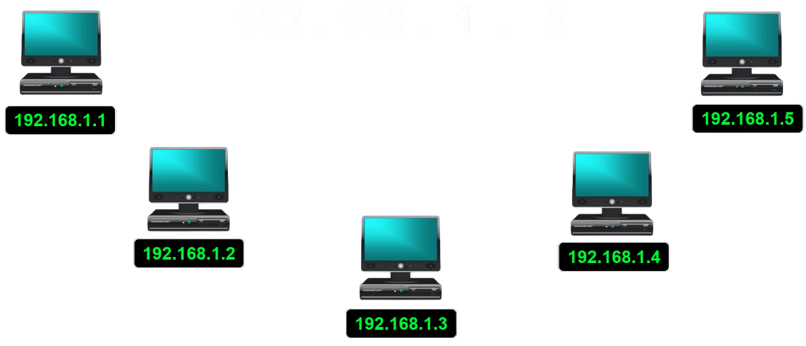
</p>

- Each group of numbers that are separated by periods are called an octet. And the number range in each octet is from 0 - 255.

<p align="center">
  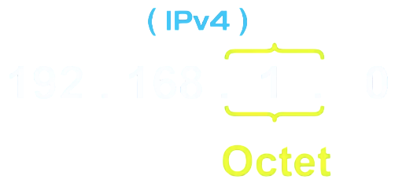
</p>

The IP address consists of **two parts**.
  1. The first part is the **network address**. It is a number that is assigned to a network. So, that every network as a unique address.
  2. The second part is the **host address**. It is assigned to hosts within that network such as computers, servers, tablets, routers, and so on. So, every host will have a unique host address.

How to identify which is the network address and the host address in an IP address?

- Here, is where the **subnet mask** number comes into play. As we know by now, a subnet mask or subnet is *a number that resembles an IP address*. And it reveals how many bits in the IP address are used for the network by masking the network portion of the IP address.

Why does an IP address have a network part and a host part?

- The reason for this is for breaking down a large network into a smaller network or subnetworks, which is known as **subnetting**.

Imagine this, consider we have an organization and it has a large amount of computers connected to a huge network. Now, when a computer wants to exchange messages with another computer, it needs to know how and where to reach that computer. It does this by using a **broadcast**.

A broadcast is essentially when a computer sends out data to all computers on the network so it can locate and talk to a certain computer. But, in the end, even if we locate the computer in this case, the idea behind this is that in any case these computers in this corporate will be constantly sharing data and communicating with each other. And, if every computer is broadcasting to find the address for its message destination it would be a chaos, a lot of traffic of data and would be too hard to pinpoint the issues and troubleshoot.

<p align="center">
  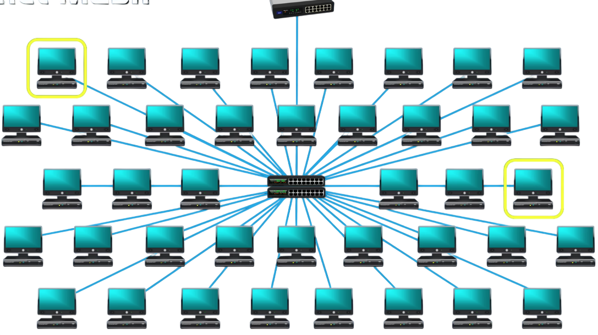
</p>

And, this is why in order to prevent this, large networks should need to be broken down into smaller networks, and networks are broken down and physically separated by using **routers**. By using routers this would solve the problem of traffic because broadcasts do not go beyond routers. Broadcasts stay within the network.

So, instead of a large network, this network is broken down into 6 subnetworks or subnets. If one computer wants to communicate with another one, the computer will send out a broadcast that only the computers within that subnetwork will. But, since that computer it wants to communicate with is in another subnetwork, the data will be sent to the **default gateway**, *which is the router*, and then the router will intelligently route the data to the destination.

<p align="center">
  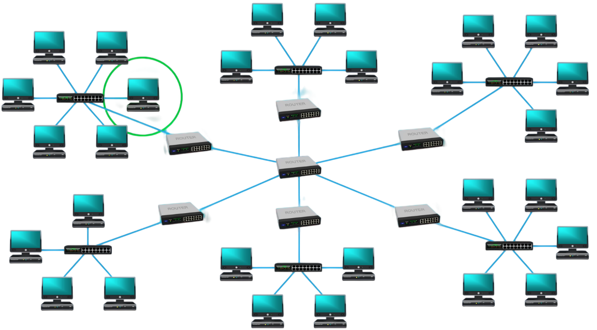
</p>

This is why IP addresses have a network portion and a host portion, so networks can be logically broken down into smaller networks which is known as subnetting.

### Classes of IP addresses and Subnet masks

IP addresses and Subnet masks come in **5 different classes** specifically.
Which include classes A - E. However, 3 of these classes are for commercial use.

Below is a chart of the IP addresses and default subnet masks which are *class A, B, C*. To differentiate, the number in the first octet of the IP address and by the default subnet mask on which class they belong to.
When an organization needs networking they will need an IP address class according to the needs of that organization, which is based on how many hosts they have. So, if an organization has a very large amount of hosts, they will need a class A IP address. A class A address can produce up to 16 million hosts. An example for this, would be the ISP, because they would need to distribute millions of IP addresses to all their customers.

<p align="center">
  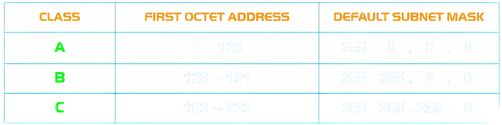
</p>

Also, a different way to express subnet masks is a method called **CIDR** which stands for **Classless Inter-Domain Routing** also known as **slash notation**. Slash notation is a shorter way to write a subnet mask. And it does this by writing a forward slash notation and then a number counting the 1s in the subnet mask.

For example, if an IP address like this, with a CIDR notation of \24 this means that the subnet mask is 24 bits in length, meaning it has 24 -> 1s.

<p align="center">
  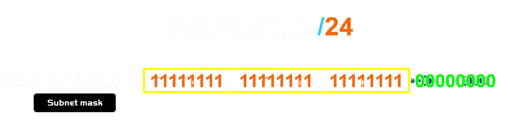
</p>
More examples of this notation:

<p align="center">
  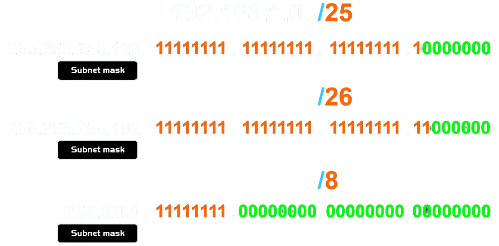
</p>


## Conclusion

Networking is a logical system built on a small set of rules that, once understood, make everything predictable.

A message traveling from one machine to another follows a clear path: it carries an IP address that identifies both where it comes from and where it is going, a subnet mask that defines the boundaries of the network it belongs to, and a default gateway that knows how to forward it when the destination is out of reach.

Switches connect devices within the same network. Routers separate networks from each other and direct traffic between them. Subnets keep broadcast traffic contained, networks manageable, and data secure.

Every concept in this documentation, like IP classes, CIDR notation, LAN, WAN, gateways, exists to solve one problem: *how to deliver data reliably across a system of millions of devices without it turning into chaos.*

That is the foundation of NetPractice.

## Instructions
### How to use this training interface

The repository contains a directory called `net_practice` which holds 10 different exercises of increasing difficulty, Each exercise simulates a real network scenario and teaches how devices communicate using IP addresses, subnet masks, gateways, switches, and routers.

### Running the interface

To launch the training interface, open a terminal in the root of the repository and run:

```bash
./run.sh
```
A page will open in the browser. Enter your intra login when prompted then click **start** to begin.

> If the permission is denied, run `chmod +x run.sh` first.

### Navigating the exercises

Each level presents a broken network. The goal is to fix it by filling in the correct values IP addresses, subnet masks or gateway addresses, until all the connections are established. A green indicator confirms a successful configuration.

Use *Check again* button to validate your solution before moving on.

### Exporting a configuration

Once a level is solved, click the *Get my config* button to download the configuration file for that level. Each exported file must be saved, these are what get submitted.

## Study Resources

#### Introduction to Networking
  - [CS 198 - Introduction to the Internet](https://textbook.cs168.io/intro/intro.html)
  - [Networking Overview](https://www.youtube.com/watch?v=kNKHM_isojI)
  - [Networking (Article | A mini guide to networking)](https://datahacker.blog/industry/technology-menu/networking)
  - [Networking Animated Videos (**I truly recommend these videos**)](https://www.youtube.com/playlist?list=PL7zRJGi6nMRzg0LdsR7F3olyLGoBcIvvg)
  - [RFC (Contains technical and organizational documents about the Internet)](https://www.rfc-editor.org/)

#### OSI & TCP/IP Models
  - [OSI Model (Wikipedia)](https://en.wikipedia.org/wiki/OSI_model)
  - [Brief Introduction to OSI Layers](https://docs.netgate.com/pfsense/en/latest/network/index.html#brief-introduction-to-osi-model-layers)
  - [OSI vs TCP/IP Models (Video)](https://www.youtube.com/watch?v=3b_TAYtzuho&t=75s)

#### IP Addressing Basics
  - [What is an IP Address? (Video)](https://www.youtube.com/watch?v=5WfiTHiU4x8&list=PLIhvC56v63IKrRHh3gvZZBAGvsvOhwrRF)
  - [What is an IP Address? (Article)](https://www.fortinet.com/resources/cyberglossary/what-is-ip-address)
  - [Public vs Private IP Address](https://docs.netgate.com/pfsense/en/latest/network/addresses.html)
  - [Static vs Dynamic IP Address](https://www.fortinet.com/resources/cyberglossary/static-vs-dynamic-ip)
  - [DHCP (Dynamic Host Configuration Protocol)](https://www.fortinet.com/resources/cyberglossary/dynamic-host-configuration-protocol-dhcp)

#### Routes and Rules
  - [Routers, Routes, Subnets, and Netmask](https://datahacker.blog/industry/technology-menu/networking/routers,-routes,-subnets,-and-netmasks)
  - [What is a gateway? (Article)](https://datahacker.blog/industry/technology-menu/networking/routes-and-rules/gateways)
  - [Introduction to Split Gateways](https://datahacker.blog/industry/technology-menu/networking/routes-and-rules/introduction-to-split-gateways)

#### Subnetting and CIDR
  - [IP Addres, Subnet & Gateway Configuration](https://docs.netgate.com/pfsense/en/latest/network/subnets.html#ip-address-subnet-and-gateway-configuration)
  - [IP Subnet Concepts](https://docs.netgate.com/pfsense/en/latest/network/subnets.html)
  - [Understanding CIDR](https://docs.netgate.com/pfsense/en/latest/network/cidr.html)
  - [CIDR (Cheat Sheet)](https://subnet.im/cheat-sheet)

#### Core Networking Protocols
  - [TCP/IP Overview](https://www.fortinet.com/resources/cyberglossary/tcp-ip)
  - [DNS (Domain Name System)](https://www.fortinet.com/resources/cyberglossary/what-is-dns)

#### Network Concepts
  - [Broadcast Domains](https://docs.netgate.com/pfsense/en/latest/network/broadcast-domains.html)

## AI usage
No AI tools were used in this project, in line with the 42 AI policy.
Solutions were validated through peer reviews and independent research.
